# Git的学习

## 1、认识Git
## 2、Git理论基础
### 2.1、Git官网 ：https://git-scm.com
##### 下载安装成功以后，初次使用Git前的配置：
##### 在命令行模式输入如下的命令：
```text
git config --global user.name "用户名"
git config --global user.email "邮箱"
```
### 2.2、理论基础
#### 2.2.1、Git记录的是什么
SVN记录的是每一次版本变动的内容，Git则是将每个版本独立的保存。
这种管理虽然耗费了更多的空间，但是在分支管理上，却带来了很多的
益处和便利。 
#### 2.2.2、三棵树
##### 工作区：你平时存放项目的地方，你看得见的地方
##### 暂存区：用于临时存放你的改动，事实上他是一个文件，他保存的是即将提交到仓库的列表信息
##### Git仓库：最终存放所有版本数据的位置，这里面有你提交的所有版本的数据，其中Head指针指向的是你最新提交的内容。我们说的第三棵树，实际上就是Git仓库里面Head 指针指向的最新版本的数据
#### 2.2.3、Git的工作流程
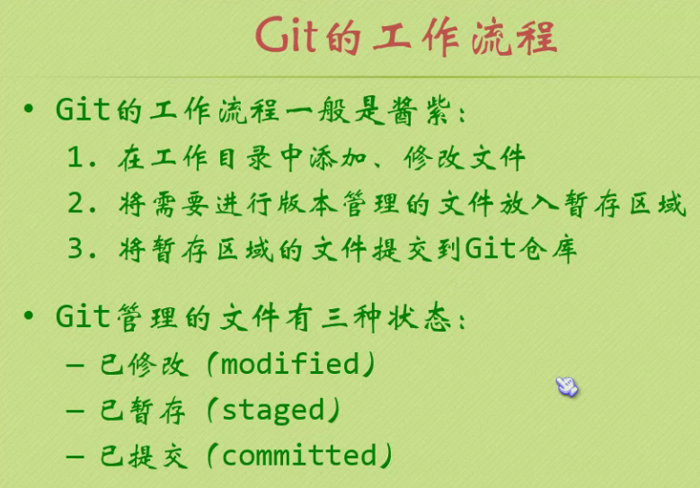
```text
//进入工作目录
git init //初始化git仓库，会在该目录下创建 .git 目录
git add 文件名 // 将文件添加到暂存区域
git commit -m "注释" //将暂存区的文件提交到Git仓库
```
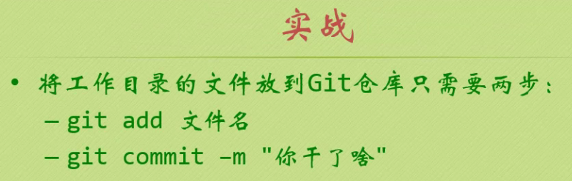

## 3、查看工作状态和历史提交
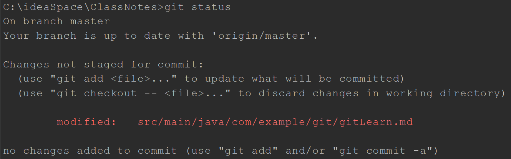
```text
git status // 查看工作状态
git reset HEAD <file> // 撤销上一步的操作
git checkout -- 文件名 // 将暂存区的内容覆盖工作区的内容(该命令较为危险)
git log // 查看历史记录
```
## 4、回到过去
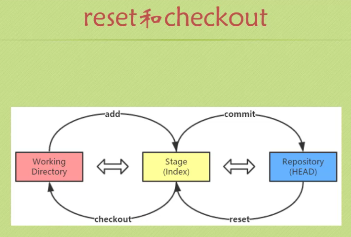
```text
git reset HEAD~ 
//加一个波浪线表示HEAD的上一个快照，
//加两个波浪线表示HEAD的上两个版本，
//加n个波浪线表示HEAD的前n个快照

git reset HEAD~10 //表示HEAD的前10个快照

```
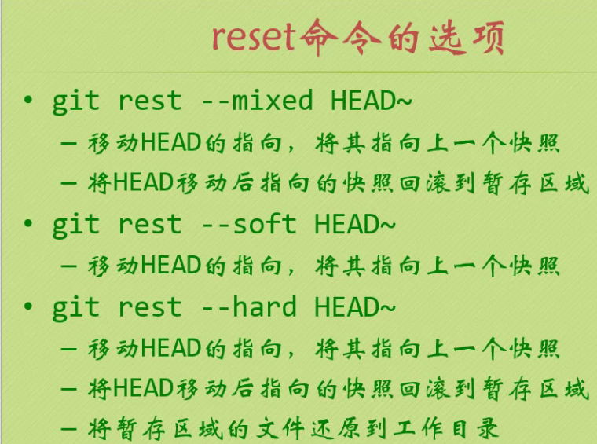
##### git reset --soft HEAD 这个命令其实相当于撤销上一次的提交（并不会修改暂存区域里面的内容）
##### git reset --hard HEAD 影响了三棵树，真TM硬
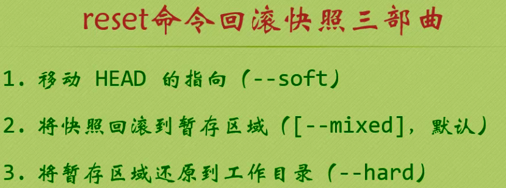
### 4.1、回滚指定快照
#### 当你的快照比较多，但是你又懒得去数到底向前回滚几个快照的时候，这个时候，你可以指定具体的ID去回滚，ID非常长，那至少提供前5个就可以了
#### git reset 版本快照 文件名/路径 // 如果是回滚个别文件的话，会忽略HEAD指针移动，因为你只是回滚个别文件，而不是整个快照。


## 5、版本对比
### 5.1、比较暂存区域和工作目录 git diff

```text
小贴士：
遇到版本比较发现省略的时候，
移动命令
按下键盘的j按键表示向下移动一行（向下键亦可）
按下键盘的k按键表示向上移动一行（向上键亦可）
f键，一页一页往下移动
b键，一页一页往上移动
d键，向下移动半页
u键，向上移动半页
小写g，跳到第一行
大写G，跳到最后一行
先输入数字3，在输入小写g，就是跳转到第三行
搜索命令：【/关键词】
输入h，表示帮助命令
退出，使用q

```
##### git diff 快照ID1 快照ID2 // 比较 ID1 和 ID2 两个版本的快照
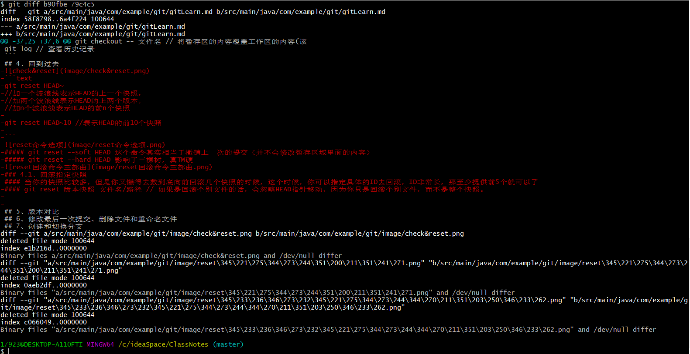
### 5.2、比较当前工作目录和Git仓库中的快照 
```text
git diff 快照ID
```
### 5.3、比较暂存区和Git仓库的快照
```text
git diff --cached [快照ID]
```
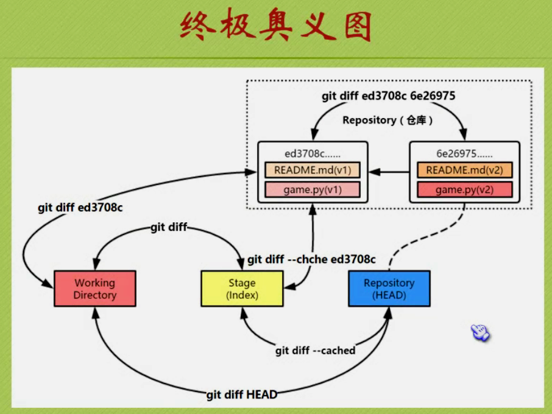


## 6、修改最后一次提交、删除文件和重命名文件
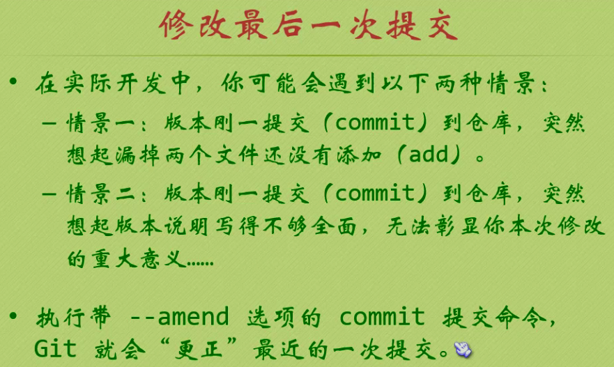

```text

# 如果不小心提交了私密文件不想让人看到怎么办？
/*
从暂存区域和工作目录中删除，
也就是说让git取消跟踪，在下次提交的时候，不再纳入版本管理
*/
git rm 私密文件名

/*
将指针修改一下
*/
git reset --soft HEAD~ 

/*
将仓库的快照文件删掉
*/
————————————————————————————

/*
强制删除
*/
git rm -f 文件名

/*
只删除暂存区的文件，保留工作区
*/
git rm --cached 文件名

/*
修改文件名
*/
git mv 旧的文件名 新的文件名

```
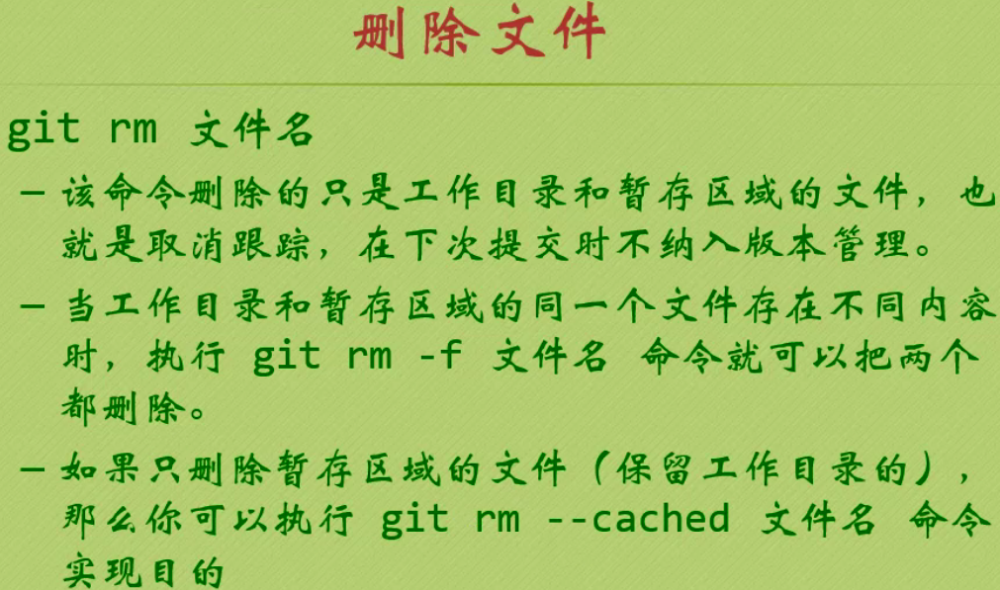

## 7、创建和切换分支
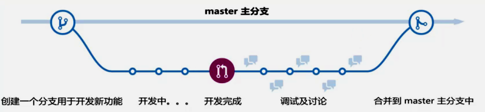
```text
// 创建分支
git branch 分支名

// 让log显示指向这个提交的所有引用
git log --decorate

// 切换分支
git checkout 分支名

// --oneline显示精简版本
git log --decorate --oneline

// --graph 以图形化显示 --all显示所有的分支
git log --decorate --oneline --graph --all
```
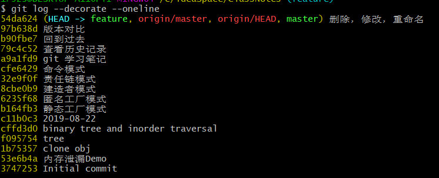
## 8、合并和删除分支
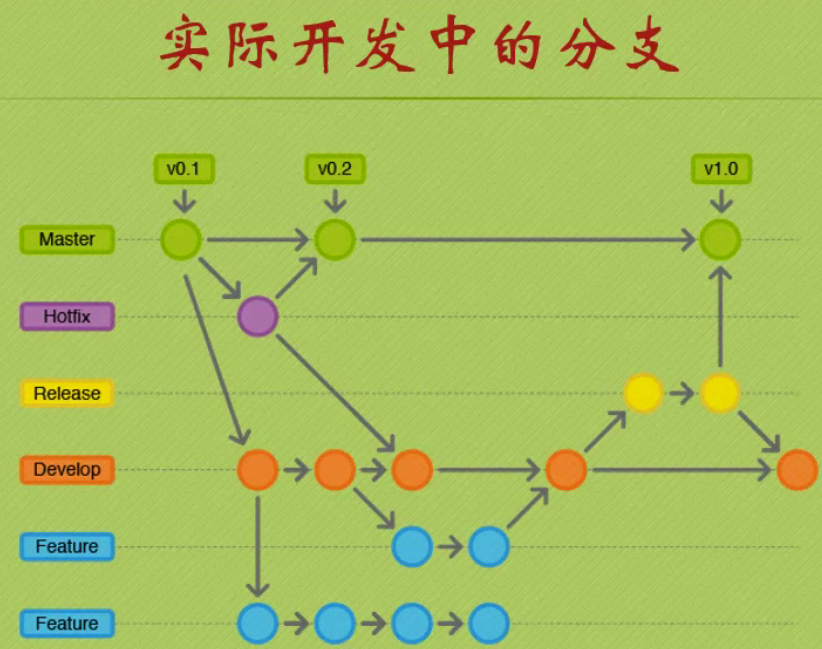
```text
// 合并分支（将指定分支合并到当前分支中来）遇到冲突，解决并提交
git merge 分支名

// 创建分支并且切换到该分支
git checkout -b 分支名

// 删除分支
git branch -d 分支名
```
## 9、匿名分支和checkout命令
## 10、创建你的GitHub账户