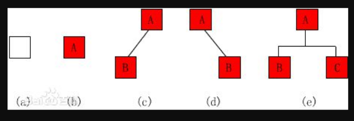

# 树形结构理解（Binary Tree）

## 二叉树

```text
    在计算机科学中，二叉树是每个结点最多有两个子树的树结构。通常子树
被称作“左子树”（left subtree）和“右子树”（right subtree）。二叉
树常被用于实现二叉查找树和二叉堆。
    一棵深度为k，且有2^k-1个节点的二叉树，称为满二叉树。这种树的特点
是每一层上的节点数都是最大节点数。
    而在一棵二叉树中，除最后一层外，若其余层都是满的，并且或者最后一
层是满的，或者是在右边缺少连续若干节点，则此二叉树为完全二叉树。具有n
个节点的完全二叉树的深度为floor(log2n)+1。深度为k的完全二叉树，至少
有2^(k-1)个叶子节点，至多有2^k-1个节点。

二叉树是递归定义的，其结点有左右子树之分，逻辑上二叉树有五种基本形态：
(1)空二叉树——如图(a)；
(2)只有一个根结点的二叉树——如图(b)；
(3)只有左子树——如图(c)；
(4)只有右子树——如图(d)；
(5)完全二叉树——如图(e)。
注意：尽管二叉树与树有许多相似之处，但二叉树不是树的特殊情形。
```


