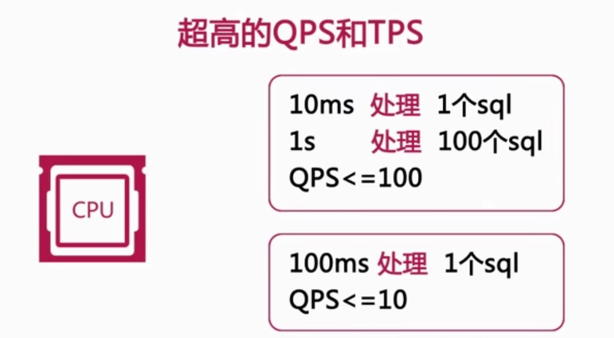
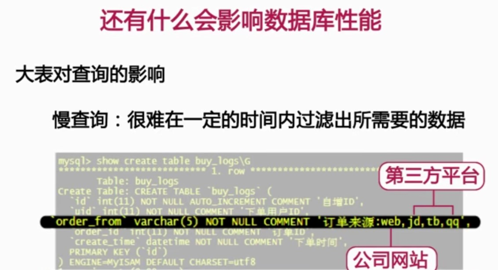
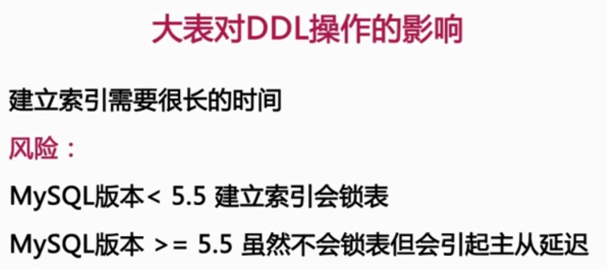

# 1-2
## 数据库监控信息（什么影响了数据库服务器的性能）
##### 1.QPS:35万次（每秒处理的查询量）
##### 2.TPS:5万次
##### 3.#并发量:700个（同一时间处理的请求数量） 
##### 4.CPU使用率:100%
#### 5.磁盘IO:500多次

以上，sql查询的速度，服务器的硬件，网卡的流量，磁盘的IO等等，都是对数据库性能影响比较大的一些因素。

# 1-3
## 超高的QPS和TPS会带来哪些风险呢
##### 1.效率低下的SQL
当前的MySQL版本中呢，并不支持多CPU的并发运算，每一个SQL只能用到一个CPU。   
一条SQL执行100ms和10ms的区别是天壤之别。  
就以往的经验来说，数据的性能不行，80%都是由于慢查询所造成的。  

## 大量的并发和超高的CPU使用率会给我们带来什么样的风险呢
##### 1.大量的并发导致数据库的连接数被占满
并发量和连接量这两个概念，在这里我们所说的并发量是指，同一时刻所需要数据库服务器处理的请求的数量。   
而连接量往往要比并发量大的多得多，现在的系统中，每一个系统使用的nigix，tomcat，apache等等都会对数据库建立多个连接。而众多的连接中通常只有几个在被数据库处理，其他的链接大多数都处于sleep状态。  
**对于数据库来说所能允许的最大连接数是有限制的，MySQL通常是由max_connections来控制的，默认值100**  
如果这个值过于小的话，可能前台服务器就会无法链接数据库，前端页面可能就会出现500的错误提示。

##### 2.超高的CPU使用率可能会因为CPU的资源耗尽而宕机
## 磁盘IO，会给我们带来哪些风险
##### 1.磁盘IO性能突然下降
这往往会发生在我们的热数据远远大于服务器使用内存的情况下，为了解决这个问题，我们只能通过使用更快的磁盘设备，如更好的read卡，SSD，等等。
在大促之前，也可以对一些大量消耗磁盘性能的计划任务，做一些调整。做好磁盘维护。

## 网卡流量对性能造成的影响
##### 1.网卡IO被占满
这时候，如果要有新的链接要查询数据库，会造成无法链接数据库的情况。
应对策略：
1.1减少从服务器的数量，因为每一个从服务器都要从主服务器上去复制日志，从服务器越多，网络流量越大
1.2进行分级缓存，一定要避免前端缓存突然大量失效，对数据库产生冲击
1.3避免使用select * 这样的查询，查询出没有必要的列，也会产生大量的流量
1.4分离业务网络和服务器网络

# 1-4 
## 大表带来的问题
什么样的表称为大表呢？大表是相对而言的，针对不同的存储引擎会有不同的限制。目前的innodb呢，没有明确说是限制多少，只要存储空间足够，都可以，但在实际使用中，我们会发现当一个表的数据超过千万行的时候。就会对数据库的性能造成影响。
##### 记录行数过大，单表超过一千万行。
##### 表数据文件巨大，表数据文件超过了10个G
**当然以上是通常定义，实际需要视业务场景或者磁盘IO而定**
比如一些表，只是用来记录一些日志的，也就是说只有insert操作和少量的select操作，几乎没有update和delete操作的话  
这样的表就是超过一千万行，可能对我们的业务也不会造成什么样的影响。但是也是会有例外的情况。  
比如之前有一张日志表，表上的数据差不多已经快有一十个亿了，工作的一直很稳定，因为平时很少有人去关注他，但是当有一天，业务需要给日志表加入更多的列，这个时候发现这会是一件非常痛苦的事情。尤其是当这张表的数据还被同步的n个服务器上的时候，简直是灾难。

上面的订单来源日志表，其中order_from字段来控制。该表目前已经有上亿条记录了，由于之前也没有需求对该表进行查询，所以也一直没有发生任何问题。
直到有一天运营人员提出查看京东来源的订单量，这一下产生了大量的问题。由于订单来源渠道只有四个，所以区分度较低。要在上亿数据中筛选一部分数据，会产生大量的磁盘IO，同时磁盘的效率也会很低。

# 1-5
## 大事务带来的影响
##### 什么是事务？
1、事务是数据库系统区别于其他一切文件系统的重要特性之一
2、事务是具有原子性的SQL语句，或者一个独立的工作单元，事务总的所有SQL要么全部完成，要么全部失败
### 事务必须具有 原子性，隔离性，持久性，一致性
#### 一、事务的原子性
##### 一个事务必须被视为一个最小的单元，事务中的所有操作，要么都完成，要么都失败。对于一个事务来说，不可能执行其中的一部分操作
#### 二、事务的一致性
##### 一致性是指事务将数据库从一种一致性状态，转变为另一种一致性状态，事务开始之前和完成之后，数据库中的数据完整性，么有被破坏。
#### 三、事务的隔离性
##### 一个事务在对数据库中的数据修改，在完成提交之前其他事务是不可见的
##### 事务隔离级别
1.未提交读  
2.已提交读  
3.可重复读  
4.可串行化  

